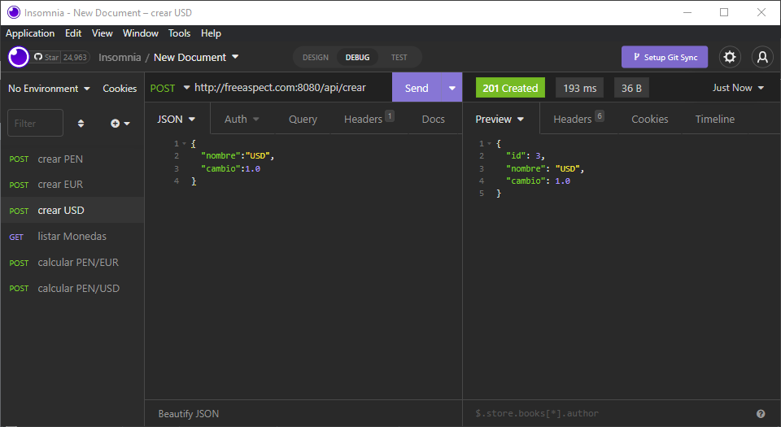

# prueba-tecnica

## Dependencias
- permitir el puerto 8080 en el firewall: 
```
ufw allow 8080
```

- docker
- docker-compose

## Despliegue del Docker

Ejecutar el archivo `docker-compose.yml`

## Uso del API
> crear moneda PEN


> crear moneda EUR


> crear moneda USD


> listar Monedas


> calcular cambio entre monedas PEN/EUR


> calcular cambio entre monedas PEN/USD
